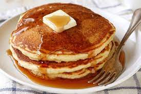

# project-meal-hub

        <!-- single item -->
        <article class="menu-item">
          
          

            <header>
              <h4>buttermilk pancakes</h4>
              <h4 class="price">$15</h4>
            </header>
            

              Lorem ipsum dolor sit amet consectetur adipisicing elit.
              Repudiandae, sint quam. Et reprehenderit fugiat nesciunt inventore
              laboriosam excepturi! Quo, officia.
            

          

        </article>
        <!-- end of single item -->
         <!-- single item -->
         <article class="menu-item">
          
          

            <header>
              <h4>diner double</h4>
              <h4 class="price">$12.99</h4>
            </header>
            

              Lorem ipsum dolor sit amet consectetur adipisicing elit.
              Repudiandae, sint quam. Et reprehenderit fugiat nesciunt inventore
              laboriosam excepturi! Quo, officia.
            

          

        </article>
        <!-- end of single item -->
        <!-- single item -->
        <article class="menu-item">
          
          

            <header>
              <h4>godzilla milkshake</h4>
              <h4 class="price">$6.99</h4>
            </header>
            

              Lorem ipsum dolor sit amet consectetur adipisicing elit.
              Repudiandae, sint quam. Et reprehenderit fugiat nesciunt inventore
              laboriosam excepturi! Quo, officia.
            

          

        </article>
        <!-- end of single item -->
                <!-- single item -->
                <article class="menu-item">
                  
                  

                    <header>
                      <h4>country delight</h4>
                      <h4 class="price">$20.99</h4>
                    </header>
                    

                      Lorem ipsum dolor sit amet consectetur adipisicing elit.
                      Repudiandae, sint quam. Et reprehenderit fugiat nesciunt inventore
                      laboriosam excepturi! Quo, officia.
                    

                  

                </article>
                <!-- end of single item -->     
                 <!-- single item -->
        <article class="menu-item">
          
          

            <header>
              <h4>egg attack</h4>
              <h4 class="price">$22.99</h4>
            </header>
            

              Lorem ipsum dolor sit amet consectetur adipisicing elit.
              Repudiandae, sint quam. Et reprehenderit fugiat nesciunt inventore
              laboriosam excepturi! Quo, officia.
            

          

        </article>
        <!-- end of single item -->
                         <!-- single item -->
                         <article class="menu-item">
                          
                          

                            <header>
                              <h4>oreo dream</h4>
                              <h4 class="price">$18.99</h4>
                            </header>
                            

                              Lorem ipsum dolor sit amet consectetur adipisicing elit.
                              Repudiandae, sint quam. Et reprehenderit fugiat nesciunt inventore
                              laboriosam excepturi! Quo, officia.
                            

                          

                        </article>
                        <!-- end of single item -->
                                         <!-- single item -->
        <article class="menu-item">
          
          

            <header>
              <h4>bacon overflow</h4>
              <h4 class="price">$8.99</h4>
            </header>
            

              Lorem ipsum dolor sit amet consectetur adipisicing elit.
              Repudiandae, sint quam. Et reprehenderit fugiat nesciunt inventore
              laboriosam excepturi! Quo, officia.
            

          

        </article>
        <!-- end of single item -->
          <!-- single item -->
          <article class="menu-item">
                          
                          

                            <header>
                              <h4>american classic</h4>
                              <h4 class="price">$22.99</h4>
                            </header>
                            

                              Lorem ipsum dolor sit amet consectetur adipisicing elit.
                              Repudiandae, sint quam. Et reprehenderit fugiat nesciunt inventore
                              laboriosam excepturi! Quo, officia.
                            

                          

                        </article>
      

      

/_ section _/
.section {
padding: 5rem 0;
}

main {
min-height: 100vh;
display: grid;
place-items: center;
}
/_ Menu _/
.menu {
padding: 5rem 0;
}
.title {
text-align: center;
margin-bottom: 2rem;
}
.underline {
width: 5rem;
height: 0.25rem;
background: #c59d5f;
margin-left: auto;
margin-right: auto;
}
/_ .btn-container {
margin-bottom: 4rem;
display: flex;
justify-content: center;
} _/
.filter-btn {
background: transparent;
border-color: #c59d5f;
font-size: 1rem;
text-transform: capitalize;
margin: 0 0.5rem;
letter-spacing: 1px;
border-radius: 0.5rem;
padding: 0.375rem 0.75rem;
/_ color: #c59d5f; _/
cursor: pointer;
transition: var(--transition);

}
.filter-btn:hover {
background: #c59d5f;
color: var(--clr-white);
}
.section-center {
width: 90vw;
margin: 0 auto;
max-width: 1170px;
display: grid;
gap: 3rem 2rem;
justify-items: center;
}
.menu-item {
display: grid;
gap: 1rem 2rem;
max-width: 25rem;
}
.photo {
object-fit: cover;
height: 200px;
border: 0.25rem solid #c59d5f;
border-radius: var(--radius);
}
.item-info header {
display: flex;
justify-content: space-between;
border-bottom: 0.5px dotted var(--clr-grey-5);
}
.item-info h4 {
margin-bottom: 0.5rem;
}
.price {
color: var(--clr-gold);
}
.item-text {
margin-bottom: 0;
padding-top: 1rem;
}

@media screen and (min-width: 768px) {
.menu-item {
grid-template-columns: 225px 1fr;
gap: 0 1.25rem;
max-width: 40rem;
}
.photo {
height: 175px;
}
}
@media screen and (min-width: 1200px) {
.section-center {
width: 95vw;
grid-template-columns: 1fr 1fr;
}
.photo {
height: 150px;
}
}

const mealName = document.querySelector(".card-title");
const category = document.querySelector(".card-title");
const price = document.querySelector(".card-text");
const desc = document.querySelector(".card-text");

const menu = fetch('https://thawing-atoll-64866.herokuapp.com/menu')
// Handle success
.then(response => response.json()) // convert to json
.then(json => console.log(json))

// const sectionCenter = document.querySelector(".section-center");

document.addEventListener("DOMContentLoaded", function (){
let displayMenu = menu.map(function (item) {
console.log(item);

// return `<article class="menu-item"> //  // 
 // <header> // <h4>${item.title}</h4> // <h4 class="price">$${item.price}</h4> // </header> // 
 // ${item.desc} // 
 // 
 // </article>`;
});
// displayMenu = displayMenu.join("");
// console.log(displayMenu);

// sectionCenter.innerHTML = displayMenu;
});

    <h3>Customer Reviews</h3>
     <form id="review-form">
       <label for="review">Your Review:</label>
       <textarea id="review"></textarea>
       <button type="submit">Add review</button>
     </form>
     

